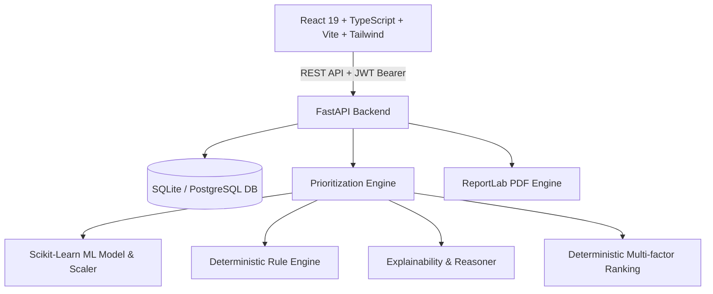

# Cyber Incident Prioritization Engine

> **Next-Generation Hybrid ML + Rule-Based Incident Prioritization with Explainable AI & Comparative Reasoning**

---

## 🎯 Executive Overview

Modern Security Operations Centers (SOCs) face alert fatigue: analysts are inundated with thousands of raw alerts daily, making it easy to miss critical threats or waste time on low-impact false positives.

The **Cyber Incident Prioritization Engine** is a full-stack platform that transforms security incident triage by combining:
1. **Machine Learning Predictive Scoring** (65% weight): A regression model trained across 55,000+ incident scenarios evaluates multi-dimensional risk factors.
2. **Context-Aware Rule Engine** (35% weight): Deterministic business logic, asset criticality boosts, off-hours risk multipliers, and historical recurrence analysis.
3. **Transparent Explainability & Comparative Reasoning**: Plain-language explanations detailing *why* an incident is ranked #1 and comparative breakdown against other incidents in the queue.
4. **Interactive What-If Simulation**: Real-time recalculation of risk scores and rank shifts based on contextual factor adjustments without altering database state.
5. **Automated Enterprise Reporting**: Executive and technical PDF report generation via ReportLab.

---

## 🏗️ Architecture



### Component Breakdown
* **Frontend**: React 19, TypeScript, Tailwind CSS, Vite, TanStack React Query v5, Zustand state management, Lucide icons, Recharts visualizations.
* **Backend**: FastAPI (Python 3.14 / 3.11+), SQLAlchemy 2.0 ORM, Pydantic v2 schemas, JWT authentication with bcrypt password hashing.
* **AI/ML Engine**: Scikit-Learn Gradient Boosting / Random Forest regressor with StandardScaler and 12 normalized contextual features.
* **Database**: SQLite (default zero-configuration) or PostgreSQL.

---

## 🧠 Hybrid Prioritization Formula

The final priority score $S \in [0, 100]$ is computed as:

$$S = 0.65 \times S_{\text{ML}} + 0.35 \times S_{\text{Rule}}$$

### 1. ML Feature Pipeline (12 Features)
* `severity` (0-100): Technical alert severity
* `data_sensitivity` (0-100): Classification of data exposed
* `asset_importance` (0-100): Criticality score of the host asset
* `attack_confidence` (0-100): Evidence certainty level
* `affected_users_normalized` (0-100): $\log$-scaled count of impacted user accounts
* `business_impact` (0-100): Evaluated operational impact
* `incident_type_encoded` (Categorical): Categorical risk index
* `asset_type_encoded` (Categorical): Categorical asset infrastructure type
* `time_risk` (0-1): Off-hours & weekend elevation multiplier
* `historical_frequency` (0-1): Rarity of alert signature
* `recurrence` (0 or 1): Past occurrence flag
* `affected_system_count_normalized` (0-100): $\log$-scaled count of systems

### 2. Priority Classification Thresholds
* **CRITICAL**: Score $\ge 80.0$
* **HIGH**: $60.0 \le \text{Score} < 80.0$
* **MEDIUM**: $30.0 \le \text{Score} < 60.0$
* **LOW**: Score $< 30.0$

### 3. Deterministic Ranking & Tie-Breaking
When scores are identical or close, ranking executes deterministic tie-breaking on:
1. `priority_score` (Descending)
2. `business_impact` (Descending)
3. `asset_importance` (Descending)
4. `attack_confidence` (Descending)
5. `detected_at` (Ascending / oldest uncontained alert first)

---

## 🚀 Quick Start Guide

### Prerequisites
* Python 3.10+ (Tested on Python 3.14)
* Node.js 18+ and npm

### 1. Backend Setup
```bash
cd backend
pip install -r requirements.txt

# Start backend server (port 8000)
python -m uvicorn app.main:app --host 0.0.0.0 --port 8000 --reload
```

### 2. Frontend Setup
```bash
cd frontend
npm install
npm run dev
```

### 3. Access the Application
* **Frontend UI**: [http://localhost:5173](http://localhost:5173)
* **Interactive API Docs (Swagger)**: [http://localhost:8000/api/docs](http://localhost:8000/api/docs)
* **Alternative API Docs (ReDoc)**: [http://localhost:8000/api/redoc](http://localhost:8000/api/redoc)

---

## 🔑 Demo Credentials

| Role | Email | Password |
|------|-------|----------|
| **Admin** | `admin@soc.local` | `Admin@1234` |
| **Analyst** | Self-register on `/register` or use admin account | — |

---

## 🧪 Running the End-to-End Demo

1. **Sign In**: Log in using `admin@soc.local` / `Admin@1234`.
2. **Seed Realistic Alerts**: Click the **"LOAD DEMO INCIDENTS"** button on the Dashboard. 100 realistic incidents and 10 assets will be ingested, scored through the live ML engine, and ranked.
3. **Explore Top Priority Incident**: Review the top-ranked card and click **"WHY #1?"** for a factor-by-factor explainability breakdown.
4. **Compare Incidents**: Open any incident and use the **Comparative Ranking** panel to see plain-language justification of relative ordering.
5. **What-If Simulator**: Navigate to `/simulator` or click from incident detail. Adjust risk sliders (e.g. reduce Severity or increase Affected Users) and click **"Recalculate Priority"** to observe real-time score and rank shifts.
6. **Generate PDF Reports**: Click **"Generate Report"** on any incident or navigate to `/reports` to download a PDF report.
7. **View Analytics**: Navigate to `/analytics` for real-time aggregation across incident types, severities, and affected assets.
8. **Inspect Model Metrics**: Navigate to `/admin` to verify model performance ($R^2$, RMSE, MAE), feature importance ranking, and audit logs.

---

## 📡 API Reference Overview

### Authentication
* `POST /api/auth/register`: Create a new user
* `POST /api/auth/login`: Authenticate and receive JWT access token
* `GET /api/auth/me`: Get current logged-in user profile

### Incidents & Prioritization
* `GET /api/incidents/ranking`: Retrieve ranked queue with pagination and status filters
* `GET /api/incidents/{id}`: Detailed incident view with factors, prediction split, and explanations
* `POST /api/incidents`: Create incident and auto-score
* `POST /api/incidents/{id}/prioritize`: Force recalculation of single incident
* `PATCH /api/incidents/{id}/status`: Update status (`new`, `investigating`, `contained`, `resolved`)
* `POST /api/incidents/{id}/compare/{other_id}`: Comparative explainability engine

### Simulation & Analytics
* `POST /api/simulator`: Non-persistent what-if priority recalculation
* `GET /api/analytics`: Aggregated incident stats, distributions, and top assets
* `POST /api/reports`: Generate PDF report
* `GET /api/reports/{id}/download`: Download generated PDF
* `GET /api/model/performance`: ML model metrics and feature importance
* `POST /api/demo/load`: Seed demo incident dataset through scoring pipeline

---

## 🔬 ML Training Pipeline

To retrain the ML model from scratch on synthetic incidents:
```bash
# 1. Generate synthetic dataset
python ml/dataset/generate.py

# 2. Train regression models and export model artifacts
python ml/training/train.py
```
Artifacts are saved to `ml/models/`:
* `priority_model.pkl`
* `scaler.pkl`
* `feature_config.json`
* `evaluation_metrics.json`

---

## 🛡️ Testing

Run the comprehensive automated test suite:
```bash
# Run backend and ML tests
python -m pytest tests/backend/ tests/ml/ -v
```

---

## 📜 License
MIT License. Built for Cybersecurity Incident Response automation and triage optimization.
